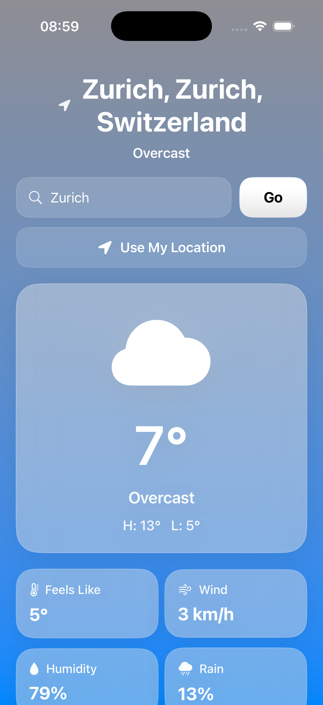
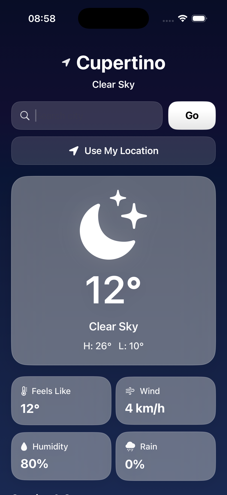
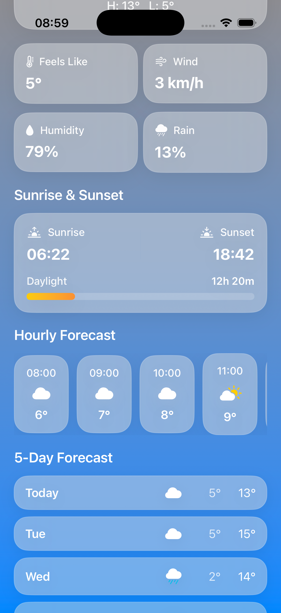

# 🌦 ClimaFlow


> ⚡ Built to demonstrate modern SwiftUI architecture, Core Location integration, and responsive UI design.

ClimaFlow is a modern iOS weather application built with SwiftUI and MVVM architecture.  
It provides real-time weather data using location services or city search, with a smooth and responsive user experience.

---

## 🎬 Demo

[▶️ Watch Demo](https://github.com/user-attachments/assets/583d8562-467a-4a96-b62c-3af04f4f276e)
---

## 📸 Screenshots

| Light | Dark |
|------|------|
|  |  |

### Forecast



---

## 📱 App Store

Coming soon 🚀

---

## ✨ Features

- 📍 Real-time location-based weather  
- 🔍 City search with instant results  
- ⭐ Save and manage favorite cities (local storage)  
- 🧭 Tab-based navigation (Home, Favorites, Settings)  
- 🔄 Pull-to-refresh support  
- 🌙 Dynamic day/night UI with weather-based backgrounds  
- ⚡ Async/await data fetching  
- 🧠 Smart state handling with Combine  

---

## 🚀 Roadmap

- ⚙️ Expand Settings (units, preferences)  
- 🌍 Multi-language support  
- 📱 Home screen widgets (WidgetKit integration)  
- ⌚ Apple Watch companion app (watchOS)  
- 🌐 Offline-first support with cached data  
- 🔔 Weather alerts and notification system  
- ⚡ Performance and data layer optimizations  

---

## 🏗 Architecture

Built using MVVM (Model-View-ViewModel) with a modular, multi-screen structure:

- SwiftUI Views (Home, Favorites, Settings)  
- Tab-based navigation via MainTabView  
- Shared ViewModel for app-wide state  
- Service layer for API communication  
- Combine for reactive data flow  

👉 [Developer Notes](./SkyCast%20%E2%80%94%20Weather%20App/Weather-Helper/DEV_NOTES.md)

---

## 🛠 Development Workflow

This project follows a feature-branch workflow:

- Create a branch for each feature or fix  
- Commit changes with clear messages  
- Push to GitHub (portfolio) and GitLab (backup)  
- Open a Pull Request  
- Merge into `main`  

Additional notes:
- Secure authentication is used (no tokens)  
- Configured to sync with multiple remotes   

---

## 🛠 Tech Stack

- Swift  
- SwiftUI  
- Xcode  
- MVVM Architecture  
- Open-Meteo API  

---

## ▶️ Installation

```bash
git clone https://github.com/rockycali/SkyCast-Weather-App.git
cd SkyCast-Weather-App
open SkyCast.xcodeproj
```

Or manually:

1. Open the project in Xcode  
2. Select a simulator or device  
3. Click Run ▶️

### Requirements
- Xcode 15+  
- iOS 17+  

---

## 🌐 API

This app uses:

- [Open-Meteo API](https://open-meteo.com/)  

✔ No API key required  
✔ Fast and reliable weather data  

---

## 📚 Documentation

Full documentation available in the Wiki:

👉 [Project Wiki](https://github.com/rockycali/SkyCast-Weather-App/wiki)

---

## 🔗 Repository

- GitHub (primary): https://github.com/rockycali/SkyCast-Weather-App  
- GitLab (mirror): https://gitlab.com/rocky-dev-group/climaflow

---

## 🔒 Security

See [Security Policy](./.github/SECURITY.md)

---

## 👨‍💻 Author

**Rocky**  
iOS Developer 🚀
