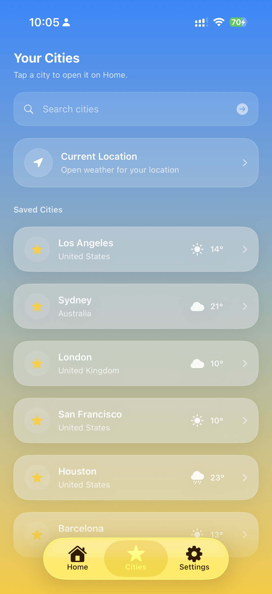
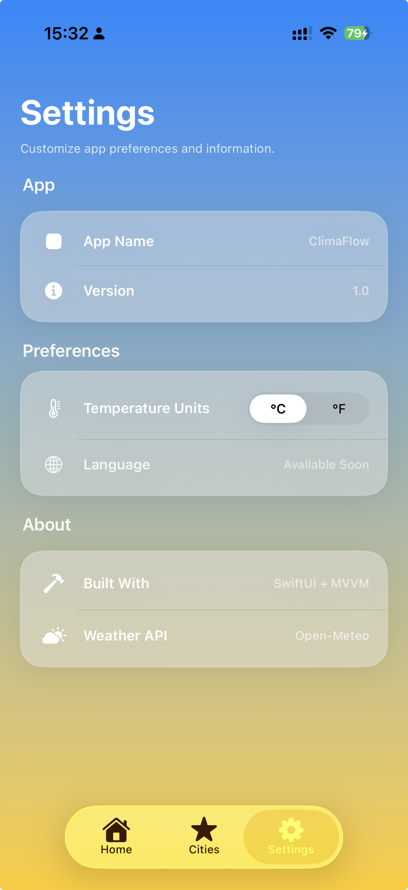

# 🌦 ClimaFlow

[](https://developer.apple.com/ios/)
[](https://www.swift.org)
[](https://developer.apple.com/swiftui/)

[](LICENSE)

> ⚡ A modern iOS weather app built with SwiftUI, MVVM, and a focus on clean architecture and polished UI.

ClimaFlow is a modern iOS weather application that delivers real-time weather data using location services or city search.  
It is designed to showcase scalable architecture, responsive UI design, and a clean developer workflow.

---

## 🎬 Demo

A quick walkthrough of ClimaFlow showcasing real-time weather, search, and dynamic UI.

▶️ [Watch Demo Video](https://github.com/user-attachments/assets/36d053cc-bae8-42ba-bd03-60bf4e7b956b)

---

## 🚀 Release

- v1.0 UI Polish  
👉 https://github.com/rockycali/SkyCast-Weather-App/releases/tag/v1.0-ui-polish

---

## 📜 Changelog

👉 [CHANGELOG](./CHANGELOG)

---

## 📸 Screenshots

| Home (Light) | Home (Night) | Cities | Settings |
|--------------|--------------|--------|----------|
|  |  |  |  |

---

## ✨ Highlights

- 📍 Real-time weather using device location  
- 🔍 Smart city search with top result highlighting and quick add actions  
- ⭐ Saved Cities system with quick weather previews  
- 🧭 Multi-screen navigation (Home, Cities, Settings)  
- 🌙 Dynamic UI adapting to weather conditions  
- 🌍 Multi-language support (EN / DE / FR)  
- ⚡ Async/await networking  
- 🧠 Reactive state handling (Combine)  

---

## 🏗 Architecture

The app follows a clean **MVVM (Model-View-ViewModel)** architecture with a modular structure:

- SwiftUI views for UI rendering  
- Dedicated ViewModels for state management  
- Service layer for API interaction  
- Local storage for persistence  
- Combine for reactive updates  

This structure ensures scalability, maintainability, and clear separation of concerns.

---

## 🛠 Tech Stack

- Swift  
- SwiftUI  
- Combine  
- MVVM Architecture  
- Open-Meteo API  

---

## ▶️ Installation

```bash
git clone https://github.com/rockycali/SkyCast-Weather-App.git
cd SkyCast-Weather-App
open SkyCast.xcodeproj
```

### Requirements
- Xcode 15+  
- iOS 17+  

---

## 🌐 API

Powered by:

- [Open-Meteo API](https://open-meteo.com/)

✔ No API key required  
✔ Fast and reliable weather data  

---

## 📚 Documentation

👉 [Project Wiki](https://github.com/rockycali/SkyCast-Weather-App/wiki)

---

## 🔗 Repository

- GitHub (primary): https://github.com/rockycali/SkyCast-Weather-App  
- GitLab (mirror): https://gitlab.com/rocky-dev-group/climaflow  

---

## 🔒 Security

See [Security Policy](./.github/SECURITY.md)

---

## 👨‍💻 Author

**Rocky**  
iOS Developer 🚀

---

> This project is continuously evolving, but the README focuses on architecture, capabilities, and overall design rather than specific feature snapshots.
