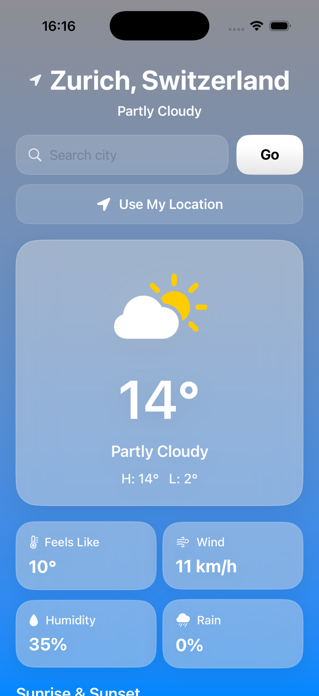
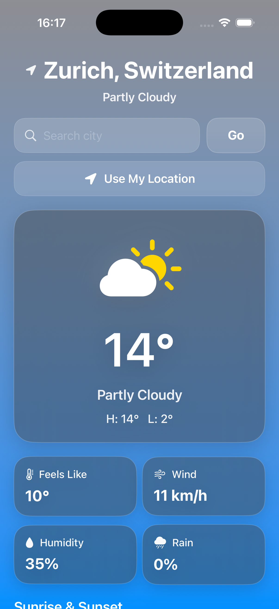

# 🌤️ SkyCast — Weather App

A modern iOS weather application built with SwiftUI, providing real-time weather data, hourly forecasts, and a 5-day outlook.

Designed with a clean, Apple-inspired UI and dynamic visuals based on current weather conditions.

---

## 📸 Screenshots

| Light Mode | Dark Mode |
|-----------|-----------|
|  |  |

---

## 🚀 Features

- 🌍 Search weather by city name  
- 📍 Get weather using current location  
- 🌡️ Current temperature and condition summary  
- 📊 Key metrics (Feels Like, Wind, Humidity, Rain)  
- 🌅 Sunrise & Sunset tracking with daylight progress  
- ⏱️ Hourly forecast  
- 📅 5-day forecast  
- 🎨 Dynamic background gradients based on weather  
- 🌙 Full Light Mode & Dark Mode support  

---

## 🚀 Upcoming Features
- [ ] ⭐ Save favorite locations
- [ ] 📱 Home screen widgets
- [ ] ⌚ Apple Watch app (watchOS support)
- [ ] 🌐 Offline mode (last known weather)
- [ ] ⚡ Performance improvements
- [ ] 🔔 Weather alerts / notifications

---

## 🛠 Tech Stack

- Swift  
- SwiftUI  
- Xcode  
- MVVM Architecture  
- Open-Meteo API  

---

## ▶️ How to Run

1. Clone the repository  
2. Open the project in Xcode  
3. Build and run on simulator or device  

### Requirements
- Xcode 15+  
- iOS 17+  

---

## 🌐 API

This app uses:

- [Open-Meteo API](https://open-meteo.com/)  

✔ No API key required  
✔ Fast and reliable weather data  

---

## 📚 Developer Notes

For detailed architecture and implementation:

👉 `SkyCast — Weather App/Weather-Helper/DEV_NOTES.md`

---

## 👨‍💻 Author

**Rocky**  
iOS Developer 🚀
